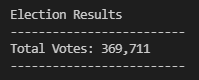
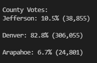
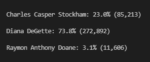
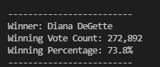

# Election_Analysis
UOFT bootcamp module 3 python

## Overview of Election-Audit:
The purpose of this election audit analysis is to understand how to read a csv file using modules, go through that data and use IF and For Loops to isolate the data we are looking for.
In this case it would be the election results and the specific details pertaining to it.   

## Election-Audit Results:
1. Number of votes cast in the congressional election 
    - 
2. Number of votes and percentage of total votes for each county in the precinct 
    - 
3. County with the largest number of votes 
    - 
4. Number of votes and percentage of total votes each candidate received 
    - 
5. Winner of the election, their vote count and percentage of total votes 
    - 

## Election-Audit Summary:

